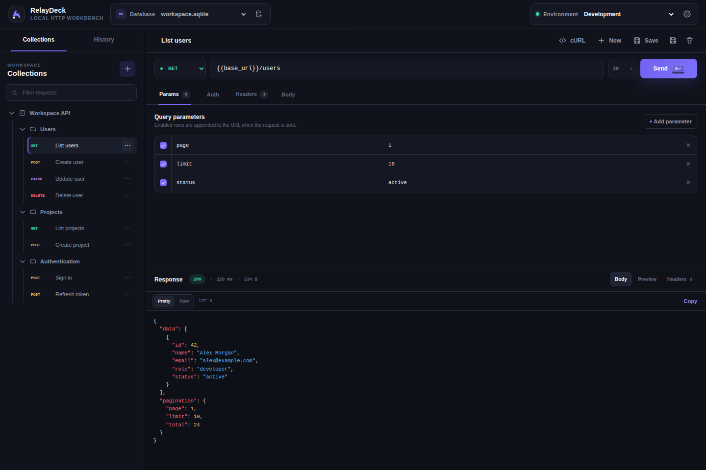

# RelayDeck

**English** | [Русский](README.ru.md)

RelayDeck is a local application for working with HTTP APIs. Its interface runs in a native BosonPHP window, requests are handled by Symfony HttpClient, and workspace data is stored in SQLite.

HTTP requests run in PHP and are not subject to browser CORS restrictions. HTML, CSS, and JavaScript are bundled with the application; the interface does not require a web server.



*Interface with demo data.*

## Features

- GET, POST, PUT, PATCH, DELETE, HEAD, and OPTIONS methods; HTTP and HTTPS.
- URL parameters, headers, and a timeout from 1 to 120 seconds, with a default of 30 seconds.
- Request bodies: JSON, text, `application/x-www-form-urlencoded`, and `multipart/form-data` with local files.
- Authentication: No Auth, Bearer Token, Basic Auth, and API Key in a header or query parameter.
- Responses: HTTP status, duration, size, headers, formatted JSON, raw body, and Preview for HTML, SVG, images, and PDF.
- Collections, nested folders, and saved requests; rename a request through the `⋯` menu.
- History: the database retains the latest 200 entries, and the interface displays the latest 100.
- Environments and `{{name}}` variables, including nested values. Autocomplete is available in the URL and the Key/Value fields of the Headers tab.
- Multiple independent SQLite databases, selectable through **Database** without restarting the application.
- Export prepared requests to cURL.
- Resizable sidebar and a responsive interface.

## Requirements

To run from source, build, and test:

- PHP **8.4.1+** for the dependencies in the current `composer.lock`.
- Composer 2.
- PHP extensions `ctype`, `ffi`, `filter`, `iconv`, `json`, `mbstring`, `pcre`, `pdo`, `pdo_sqlite`, and `phar`. FFI must be available in CLI.
- For development dependencies, including PHPUnit: `dom`, `libxml`, `reflection`, `tokenizer`, and `xmlwriter`.
- `curl` and `openssl` are recommended for HTTP(S).

System dependencies are also required when running a compiled native application:

| OS | Requirements |
| --- | --- |
| Linux | GTK 4.12+, WebKitGTK 6.0, libadwaita |
| Windows | Windows 10+ and WebView2 Runtime |
| macOS | macOS 14+ |

For Ubuntu/Debian:

```bash
sudo apt install libgtk-4-1 libwebkitgtk-6.0-4 libadwaita-1-0
```

System library versions must meet Boson's requirements. See [BosonPHP 0.19 installation](https://bosonphp.com/doc/0.19/installation) and [WebView2 Runtime](https://learn.microsoft.com/en-us/microsoft-edge/webview2/concepts/distribution).

## Run from source

From the project root:

```bash
composer install
composer check-platform-reqs
php index.php
```

`composer install` also installs development dependencies: Boson Compiler and PHPUnit.

## Install the application on Linux

```bash
composer install-desktop
```

This command builds the current source for your Linux architecture — amd64 or ARM64 — and installs an independent copy of the application **for the current user**. The installation location is determined by `XDG_DATA_HOME`, which defaults to `~/.local/share`. The current script does not implement installation to `/opt` for all users.

With the default settings, it installs:

| Component | Path |
| --- | --- |
| Application | `~/.local/share/relay-deck/relay-deck` |
| Boson library | `~/.local/share/relay-deck/libboson-linux-*.so` |
| Application menu launcher | `~/.local/share/applications/app.saucer.relaydeck.desktop` |
| Icon | `~/.local/share/icons/hicolor/scalable/apps/relay-deck.svg` |

The launcher runs the installed executable. PHP, source code, and resources are embedded in it: after installation, neither the repository nor system PHP is needed to run the application. The system GTK, WebKitGTK, and libadwaita libraries must remain installed.

Building through `composer install-desktop` requires development dependencies. On the first run, the compiler downloads build tools and caches them in `build/.desktop-install/.temp`. The intermediate build is located in `build/.desktop-install/app`.

To install an already compiled application and skip the build:

```bash
php tools/install-desktop.php build/linux/amd64/relay-deck
```

The matching `libboson-linux-*.so` library must be beside the specified executable. The installer copies both files to the installation directory and updates the launcher.

Reinstalling updates the application and preserves its `storage/` directory with databases and settings. Data from the repository's `storage/` directory is not migrated automatically. Restart the application after an update.

On Linux, the icon is associated with the window through the `app.saucer.relaydeck.desktop` launcher. On Windows, the embedded PNG favicon sets the window icon. Favicon limitations on Linux/GTK4 and macOS are described in the [WebView events documentation](https://bosonphp.com/doc/0.19/webview-events).

## Storage and databases

On the first launch without saved settings, the application creates an empty `storage/app.sqlite` database:

| Launch method | Default storage |
| --- | --- |
| `php index.php` | `storage/` in the project root |
| After `composer install-desktop` | `$XDG_DATA_HOME/relay-deck/storage/`, defaulting to `~/.local/share/relay-deck/storage/` |
| Native build or PHAR | `storage/` beside the executable or PHAR |

The database registry and the active database selection are saved in `storage/settings.json`. The database file itself contains collections, requests, history, and environments. If there is no saved database selection and a compatible `storage/app.sqlite` already exists beside the application, the application uses it. Settings from older versions in the system config directory are migrated to the adjacent storage directory after a database is successfully opened.

If database creation fails, a folder selection screen appears. If a previously selected database is unavailable, the application offers to retry the connection or select another file.

Use **Database** in the top bar to:

- Open an existing RelayDeck database with the `.sqlite` extension.
- Create a new database: enter a name, such as `work-api.sqlite`, then select a folder. The `.sqlite` extension is added automatically.

An existing database is opened at its selected path without copying it. Both the file and its directory must be writable. Multiple databases in one folder and up to 64 databases in the registry are supported. An arbitrary SQLite database or a `console.sql` file cannot be used: a compatible RelayDeck schema is required.

Switching databases resets the request editor and the current response. If there are unsaved changes, the application asks for confirmation. A failure to open another database preserves the previous active session; an unavailable database remains in the list with an `unavailable` label.

To make a backup, close the application and copy the relevant `.sqlite` files and `settings.json`. The registry stores absolute database paths: after moving databases elsewhere, open their new paths through **Database**.

## Environment variables

| Variable | Purpose |
| --- | --- |
| `RELAYDECK_DEBUG` | Enables WebView DevTools, for example when set to `1` |
| `RELAYDECK_STORAGE_DIR` | Forces the use of `app.sqlite` in the specified folder; database management and switching are disabled |
| `RELAYDECK_CONFIG_DIR` | Sets the directory for `settings.json`; database paths are selected separately |
| `XDG_DATA_HOME` | Sets the base directory for the Linux user installation |

Examples when running from source:

```bash
RELAYDECK_DEBUG=1 php index.php
RELAYDECK_STORAGE_DIR=/absolute/path/to/data php index.php
RELAYDECK_CONFIG_DIR=/absolute/path/to/config php index.php
```

Use absolute paths. When `RELAYDECK_STORAGE_DIR` is set, the selected database is not recorded in the registry. The legacy names `API_CLIENT_DEBUG` and `API_CLIENT_STORAGE_DIR` remain supported for compatibility.

If the application directory is read-only, set `RELAYDECK_CONFIG_DIR` to a writable directory: even after selecting another folder for the database, the application needs to save its registry and settings.

## Export to cURL

The **cURL** button beside **Save** opens the prepared command; **Copy** copies it. Export resolves variables from the active environment and includes enabled parameters, headers, authentication, and the request body. Exporting does not send the request or add a history entry.

The command is intended for a POSIX shell, such as bash or zsh, and requires `curl` to be installed. Multipart, binary data, and large text bodies use `base64 -d` to pass the body through stdin. The command contains resolved secrets and the bytes of selected files, so review its contents before sharing it with others.

## Limitations

- TLS certificate verification is enabled.
- Response bodies are limited to **2 MiB** (2,097,152 bytes). Once the limit is exceeded, downloading stops and the response is marked as truncated; Preview is unavailable for it.
- The total file size in enabled fields of a single multipart request is limited to **25 MiB** (26,214,400 bytes).
- The contents of selected files are not saved in collections or history. Upload the files again before resending a request.
- Requests follow at most 10 redirects. The timeout also applies to the total request duration.
- Exported cURL commands are not subject to the application's response size limit.
- HTML/SVG Preview removes scripts and event handlers, blocks external resources, and uses a sandbox. PDF rendering depends on the system WebView's capabilities.

Bearer tokens, Basic Auth passwords, API keys, and secret variable values are stored in SQLite without encryption. Marking a variable as secret hides its value in the interface. Keep databases in trusted folders and do not open the same database in multiple application instances at once.

## Build for distribution

```bash
composer compile
```

This command runs Boson Compiler and builds all targets from `boson.json`:

| Directory | Application | Native library beside the application |
| --- | --- | --- |
| `build/linux/amd64/` | `relay-deck` | `libboson-linux-x86_64.so` |
| `build/linux/aarch64/` | `relay-deck` | `libboson-linux-aarch64.so` |
| `build/windows/amd64/` | `relay-deck.exe` | `libboson-windows-x86_64.dll` |
| `build/macos/amd64/` | `relay-deck` | `libboson-darwin-universal.dylib` |
| `build/macos/aarch64/` | `relay-deck` | `libboson-darwin-universal.dylib` |
| `build/phar/` | `relay-deck.phar` | Libraries for all supported platforms |

`arm64` in the configuration is normalized to the directory name `aarch64`. To build only selected platforms, keep the corresponding entries in the `target` array of `boson.json`.

Distribute the native application together with the specified library from the same directory. PHP, dependencies, and resources are embedded in the executable. PHAR runs through system PHP with the required extensions and the native library for the relevant OS:

```bash
php build/phar/relay-deck.phar
```

Project data is not included in the build. The application creates the `storage/` directory on its first launch; there is no separate post-build step. The compiler recreates target build directories, so back up databases if you have run the application directly from `build/`.

See [compiler configuration](https://bosonphp.com/doc/0.19/compiler-configuration) and [building with BosonPHP](https://bosonphp.com/doc/0.19/compiler-building) for details.

## Tests

```bash
composer test
```

The test suite covers:

- Variable resolution, HTTP requests, validation, timeouts, and response limits.
- cURL: shell argument escaping, headers, authentication, and exact transmission of bodies and files.
- SQLite schema, migrations, settings, and switching between independent databases.
- Preserving the active session when another database fails to open.
- HTML templates and data escaping.
- Linux application installation, running after the test repository is removed, updates that preserve data, and missing library errors.

HTTP tests use `MockHttpClient`. cURL tests check the command through `/bin/sh`, replacing network calls with argument recording; these checks require `base64`. Installer tests use temporary directories and a stub compiler. The suite does not access the internet or launch a real GUI; installer checks run on Linux.

## Project structure

```text
src/
  Application/   # window, HTML renderer, storage paths, and workspace session management
  Boson/         # PHP ↔ JavaScript bindings, database selection and switching
  Database/      # PDO SQLite and schema migrations
  DTO/           # request and response
  Environment/   # variable resolution
  Exception/     # application and HTTP errors
  Http/          # request execution and cURL export
  Storage/       # collections, requests, history, and environments
resources/
  index.html
  storage-setup.html
  css/app.css
  js/app.js
  js/storage-setup.js
  icons/app.svg
  icons/app.png
tools/
  build-desktop.php
  install-desktop.php
storage/         # local databases and settings created at runtime
tests/
index.php
boson.json
composer.json
composer.lock
phpunit.xml
```

`index.php` loads Composer and starts `RelayDeckApplication`. `HtmlRenderer` embeds CSS, JavaScript, the logo, and the favicon in local WebView documents. PHP services are exposed through Boson Function Bindings; responses use the `{ok, data}` or `{ok, error}` format.

API documentation: [Bindings](https://bosonphp.com/doc/0.19/bindings-api) and [WebView](https://bosonphp.com/doc/0.19/webview).

## Keyboard shortcuts

| Shortcut | Action |
| --- | --- |
| `Ctrl/⌘ + Enter` | Send request |
| `Ctrl/⌘ + S` | Save request |
| `Ctrl/⌘ + L` | Select URL |
| `Esc` | Close a dialog or the mobile sidebar |
| `↑` / `↓` in variable suggestions | Select a variable |
| `Enter` / `Tab` in suggestions | Insert a variable |
| `Esc` in suggestions | Close suggestions |
